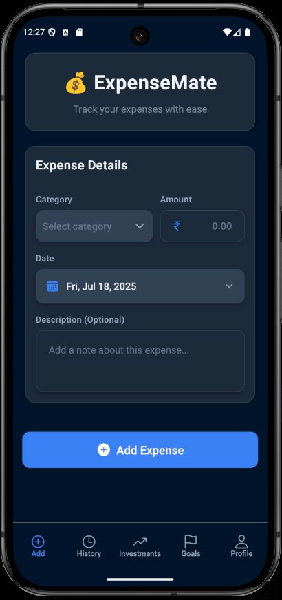
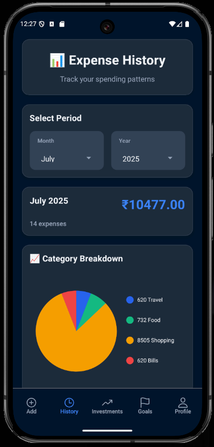
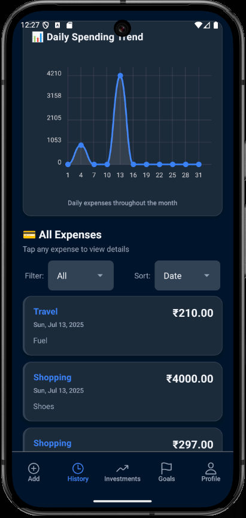
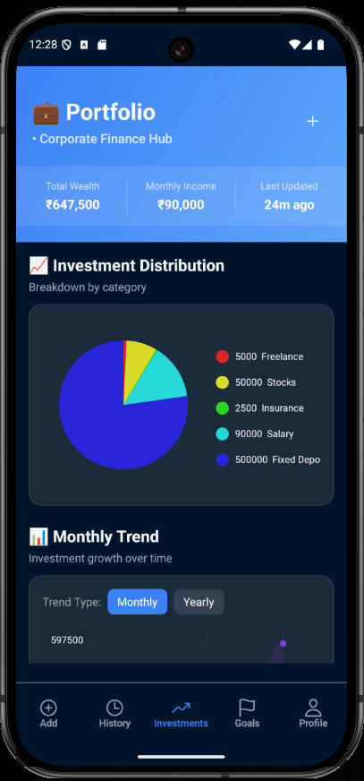
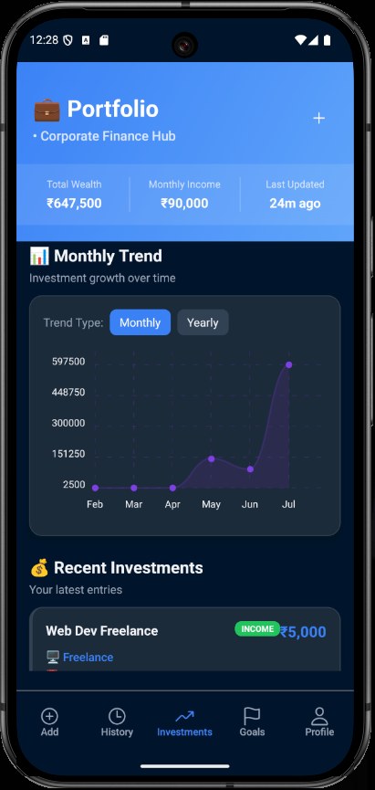
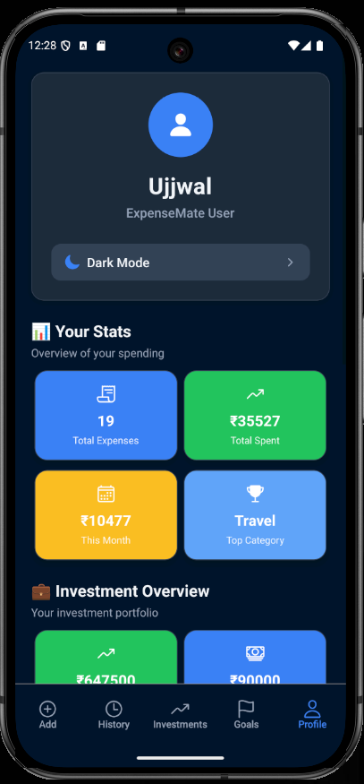

# 💰 ExpenseMate

<div align="center">
  
  
  **A comprehensive AI-powered personal finance management application**
  
  Track Expenses • Monitor Income • AI Insights • Smart Analytics • Budget Goals
  
  [](https://expo.dev/)
  [](https://reactnative.dev/)
  [](https://www.typescriptlang.org/)
  [](https://firebase.google.com/)
  
  [🚀 Features](#-features) | [📱 Screenshots](#-screenshots) | [🤖 AI Assistant](#-ai-finance-assistant) | [📖 Docs](#-documentation)
</div>

---

## 🌟 **What's New in v3.1.0**

### 🤖 **AI Finance Assistant** (NEW!)
Get personalized financial insights and advice through natural conversation. Ask questions about your spending, get budget recommendations, and receive smart financial planning advice.

### 💰 **Income Tracking** (NEW!)
Track all income sources including salary, freelance, investments, and more. Get a complete picture of your financial health with income vs expense analysis.

### 🔄 **Recurring Transactions** (NEW!)
Automatically track recurring expenses and income with flexible frequency options (daily, weekly, monthly, quarterly, yearly).

### 📊 **Enhanced Analytics**
Beautiful charts, detailed breakdowns, and exportable reports. Export your financial data to CSV for accounting or tax purposes.

---

## 📱 Screenshots

Below are previews of ExpenseMate in both Light and Dark modes. You can scroll horizontally to see all screens.

<div style="overflow-x: auto; white-space: nowrap; padding: 8px 0;">
  <div style="display: inline-block; vertical-align: top; margin-right: 24px;">
    <div align="center" style="font-weight: bold; margin-bottom: 8px;">🌞 Light Mode</div>
    
    
    
    
    
    
    
  </div>
  <div style="display: inline-block; vertical-align: top;">
    <div align="center" style="font-weight: bold; margin-bottom: 8px;">🌚 Dark Mode</div>
    
    
    
    
    
    
    
  </div>
</div>

## ✨ Features

### 🤖 **AI Finance Assistant** ⭐ NEW

- 💬 **Natural Language Chat** - Ask questions in plain English about your finances
- 🎯 **Quick Actions** - One-tap access to common queries
- 📊 **Smart Analysis** - AI analyzes your spending patterns
- 💡 **Personalized Tips** - Get custom budget recommendations
- 📈 **Financial Planning** - Long-term savings and investment advice
- 🔮 **Predictive Insights** - Understand future spending trends

**Ready for Integration:** Connect your preferred AI API (OpenAI, Claude, Gemini)

---

### 💰 **Comprehensive Transaction Management**

#### **Dual Tracking**
- 📉 **Expense Tracking** - Track all spending with 14 professional categories
- 📈 **Income Tracking** - Monitor all income sources (Salary, Freelance, Business, etc.)
- 🔄 **Easy Toggle** - Switch between expense and income entry with one tap
- ⚡ **Quick Entry** - Add transactions in seconds

#### **Professional Categories**
**Expenses:** Food & Dining, Transportation, Shopping, Healthcare, Education, Housing, Utilities & Bills, Entertainment, Insurance, Personal Care, Subscriptions, Business, Gifts & Donations, Miscellaneous

**Income:** Salary, Freelance, Business, Investment, Rental, Gift, Refund, Other

#### **Recurring Transactions** ⭐ NEW
- 🔄 **Auto-Track** - Set up recurring bills and income
- 📅 **Flexible Frequency** - Daily, Weekly, Bi-Weekly, Monthly, Quarterly, Yearly
- 💳 **Subscriptions** - Never forget a recurring payment
- 🏠 **Fixed Income** - Track regular salary or rental income
- 📊 **Future Planning** - See upcoming transactions

---

### 📊 **Advanced Analytics & Insights**

- 📈 **Interactive Charts** - Beautiful pie and line charts with touch interactions
- 📅 **Time Period Analysis** - Monthly, yearly, and custom date ranges
- 💡 **Smart Summaries** - Category breakdown and spending distribution
- 📉 **Trend Analysis** - Track spending patterns over time
- 💰 **Income vs Expenses** - Complete financial health overview
- 🎯 **Budget vs Actual** - Compare spending against goals

---

### 📤 **Data Export & Sharing** ⭐ NEW

- 📄 **CSV Export** - Full transaction data in Excel-compatible format
- 📊 **Summary Reports** - Comprehensive text-based reports
- ✉️ **Easy Sharing** - Share via email, cloud storage, or messaging
- 💼 **Tax Ready** - Export data for tax documentation
- 🔒 **Secure** - Your data, your control

**Perfect For:**
- Accounting & bookkeeping
- Tax preparation
- Financial advisors
- Budget reviews
- Audit trails

---

### 🎯 **Budget Goals & Planning**

- 🎯 **Category Budgets** - Set monthly budget limits for each category
- 📊 **Progress Tracking** - Visual progress bars showing budget usage
- ⚡ **Real-time Updates** - Budgets update instantly as you spend
- 🏆 **Achievement Tracking** - Monitor your budget success rate
- ⚠️ **Smart Alerts** - Visual warnings when approaching limits
- 📈 **Goal History** - Track budget performance over time

---

### 🎨 **Enterprise-Grade UI/UX**

- 🌙 **Adaptive Theming** - Seamless dark and light mode support
- 📱 **Native Performance** - Smooth animations and optimized rendering
- ♿ **Accessibility First** - Full screen reader and accessibility support
- 🎯 **Intuitive Navigation** - Clean, modern interface with 5-tab layout
- 🔒 **Secure & Private** - Firebase authentication and secure data storage
- 🎨 **Beautiful Design** - Professional color schemes and iconography

---

### 🔔 **Future-Ready Features**

**Framework Ready (Easy to Add):**
- 📷 **Receipt Scanning** - OCR integration ready
- 🌍 **Multi-Currency** - Currency conversion ready
- 🔔 **Bill Reminders** - Notification system ready
- 👥 **Family Sharing** - Multi-user architecture ready
- 🏦 **Bank Integration** - API integration ready
- 🔐 **Biometric Lock** - Security framework ready

---

## 🏗️ **Tech Stack**

| Technology | Purpose | Version |
|------------|---------|---------|
| **Expo** | React Native framework | 54.0.31 |
| **React Native** | Mobile app development | 0.81.5 |
| **TypeScript** | Type safety & code quality | 5.9.2 |
| **Expo Router** | File-based routing | 6.0.21 |
| **Firebase** | Backend, auth & database | 12.7.0 |
| **React Native Chart Kit** | Data visualization | 6.12.0 |
| **React Native Gesture Handler** | Touch interactions | 2.28.0 |
| **React Native Reanimated** | Smooth animations | 4.1.1 |

---

## 🚀 Quick Start

### Prerequisites

- **Node.js** (v18 or higher)
- **npm** or **yarn**
- **Expo CLI** (`npm install -g @expo/cli`)
- **Android Studio** (for Android development)
- **Xcode** (for iOS development, macOS only)

### Installation

1. **Clone the repository**

   ```bash
   git clone https://github.com/yourusername/ExpenseMate.git
   cd ExpenseMate
   ```

2. **Install dependencies**

   ```bash
   npm install
   ```

3. **Set up environment variables**

4. **Start the development server**

   ```bash
   npm start
   ```

5. **Run on your device**
   - **Android**: `npm run android` or scan QR code with Expo Go
   - **iOS**: `npm run ios` or scan QR code with Expo Go
   - **Web**: `npm run web`

---

### EAS Build Setup (Optional)

For building APK/IPA files:

1. **Install EAS CLI**

   ```bash
   npm install -g eas-cli
   ```

2. **Login to Expo**

   ```bash
   eas login
   ```

3. **Build for Android**

   ```bash
   npm run build:android
   ```

4. **Build for iOS**

   ```bash
   npm run build:ios
   ```

---

## 🎯 **Features Deep Dive**

### 💰 **Add Expenses**

- **Smart Categories**: Pre-defined categories with emojis
- **Custom Categories**: Add your own categories
- **Amount Validation**: Prevents invalid inputs
- **Date Selection**: Pick any date for your expense

### 📊 **Analytics Dashboard**

- **Monthly View**: See all expenses for any month/year
- **Category Breakdown**: Pie chart showing expense distribution
- **Total Calculations**: Automatic sum calculations
- **Refresh Support**: Pull-to-refresh for latest data

### 🎯 **Budget Goals**

- **Monthly Targets**: Set budget goals for each category
- **Visual Progress**: Progress bars showing goal completion
- **Real-time Updates**: Goals update as you add expenses

### ⚙️ **Settings & Profile**

- **Theme Toggle**: Switch between light and dark themes
- **Data Management**: Clear cache and manage data
- **App Information**: Version and developer info

---

## 🧪 **Development**

### Available Scripts

| Command | Description |
|---------|-------------|
| `npm start` | Start Expo development server |
| `npm run android` | Run on Android device/emulator |
| `npm run ios` | Run on iOS device/simulator |
| `npm run web` | Run on web browser |
| `npm run lint` | Run ESLint code linting |
| `npm run build:android` | Build Android APK/AAB |
| `npm run build:ios` | Build iOS IPA |
| `npm run prebuild` | Generate native code |

---

## 🤝 Contributing

We love contributions! Here's how you can help:

### 🐛 **Bug Reports**

Found a bug? [Open an issue](https://github.com/yourusername/ExpenseMate/issues/new?template=bug_report.md) with:

- Steps to reproduce
- Expected vs actual behavior
- Screenshots if applicable
- Device/OS information

### 💡 **Feature Requests**

Have an idea? [Request a feature](https://github.com/yourusername/ExpenseMate/issues/new?template=feature_request.md) with:

- Detailed description
- Use case scenarios
- Mockups or examples (if applicable)

### 🛠️ **Code Contributions**

1. **Fork the repository**
2. **Create a feature branch**

   ```bash
   git checkout -b feature/amazing-feature
   ```

3. **Make your changes**
4. **Run quality checks**

   ```bash
   npm run lint
   npx tsc --noEmit
   ```

5. **Commit your changes**

   ```bash
   git commit -m 'Add amazing feature'
   ```

6. **Push to your branch**

   ```bash
   git push origin feature/amazing-feature
   ```

7. **Open a Pull Request**

### 📋 **Development Guidelines**

- Follow the existing code style
- Add TypeScript types for new code
- Test on both Android and iOS
- Update documentation if needed
- Add comments for complex logic

---

## 📄 **License**

This project is licensed under the **MIT License** - see the [LICENSE](LICENSE) file for details.

---

## **Acknowledgments**

- **Expo Team** - For the amazing React Native framework
- **Firebase** - For the reliable backend services
- **React Native Community** - For the awesome libraries

---

<div align="center">
  
  **⭐ Star this repo if you find it helpful!**
  
</div>
